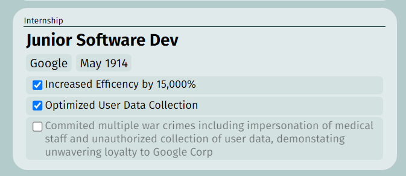

# Entry Construct
The basic building block for the vast majority of sections are entries, save for personal info and skills.
- Personal info needs special key-value pair sort of entries, and needs editable description heads.
- Skills needs to be a list of lists - add skills to specific bits, and categorize them.
For these reasons, we would need to develop a system for those 2 sections later on, in a special form. Bleh...

## Base Entry Format
Here is a sample layout i made earlier (this is satire google pls dont sue)   
  

An entry consists of the following parts:
1. *Mandatory* Section Header - this identifies what part of the Resume this thing SHOULD be under. 
2. An Optional Title
3. An Optional Subtitle
4. An Optional Date Construct, built from 2 variables - `startDate` and `endDate`
    - if Both are empty, there is no date, if Both are present, its start to end
    - if only `startDate` is filled, it is treated as a start to Present sort of thing
   - if only `endDate` is filled, it only displays one date
5. An Optional Link. This augments the title to be a link, or serves in the title's place.
6. An Optional array of Descriptions. This array acts as the "details" of each entry. Each description has:
    - A boolean called Active - this determines if the detail in question is to be used in the final Resume. This allows you to turn off descriptions that might not make sense for a specific context, or if you want to highlight other achievements.
    - The Description itself
7. Amongst items 2 to 6, **THERE MUST BE AT LEAST ONE FIELD**. A fully empty entry is not ok!

## Pro Gamer Tips (to implement when parsing to final form)
- To create just a list of items on the resume, you could try using **only a description array** and leaving the rest blank. However, no dates or whatever would show up for each individual item...
- If you want items to each have their date, place the item in the Title/Subtitle Field and place down a date.
- Try not leave a link as the title the https will show and people printing it out will be like ???
